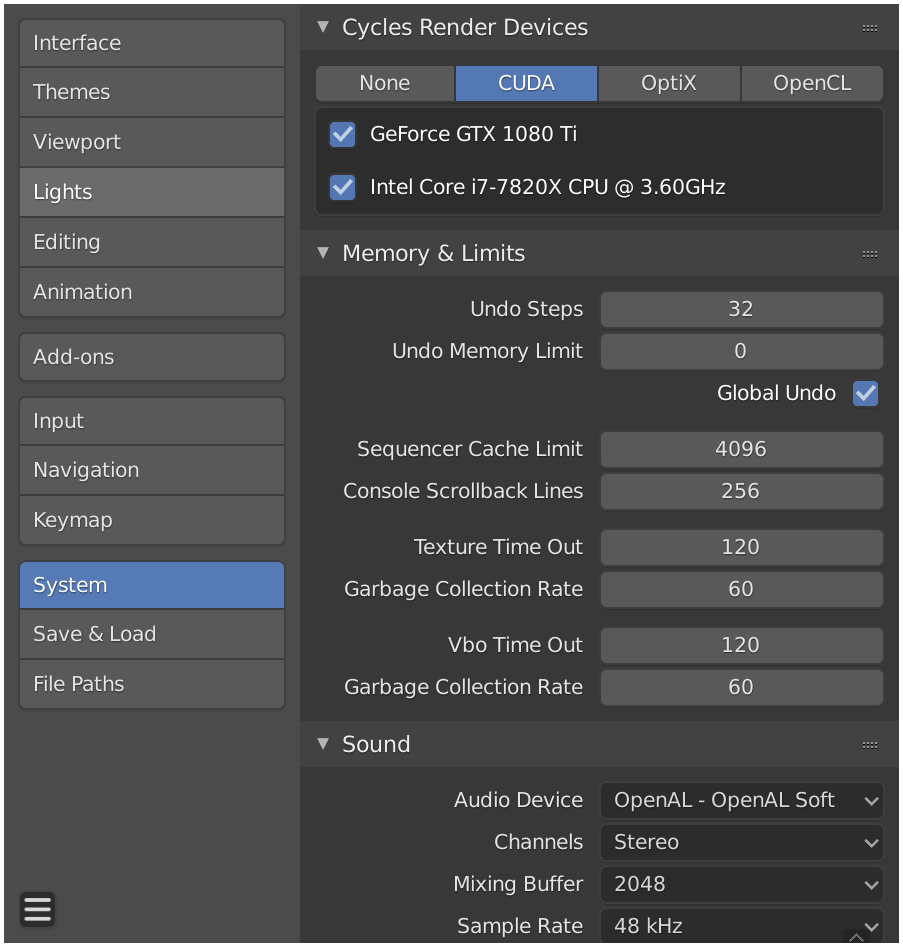

# .PLY Renderer

This codebase has been tested on Ubuntu 18.04 with Blender 2.82.

## Getting Started

On Ubuntu, install [Blender](https://www.blender.org/) with
```sh
sudo snap install blender --classic # Only for Ubuntu
```

Launch Blender to set up GPU rendering, as Blender doesn't do this by default. Go to `Edit` -> `Preferences` -> `System` -> `Cycles Render Devices`, select CUDA, and enable your CUDA devices.




## Rendering .ply files

To render a .ply file
```sh
blender base-scene.blend --background --python main.py --input <path to .ply>
```

To test, run `demo.sh` from the root directory of the repo, which downloads a test `.ply` and renders it to `output/test-1.png`.
```sh
#/bin/bash
wget columbia.edu/~hqh2101/test-1.ply
blender base-scene.blend --background --python main.py --input test-1.ply
```


output of `demo.sh`